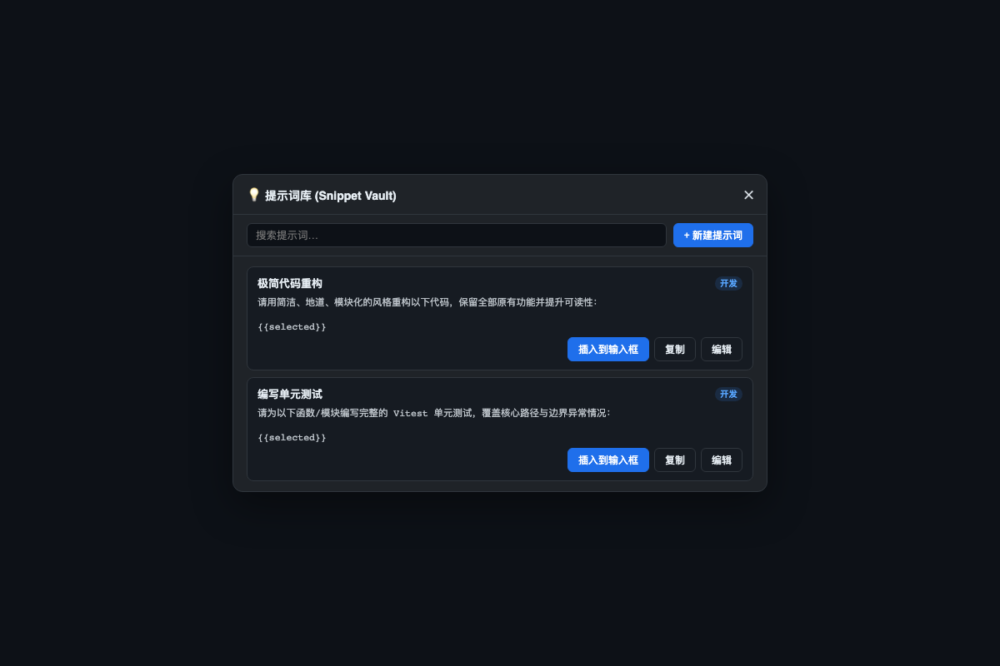

# dsh-snippet-vault

[简体中文](README.md) · [Español](README.es.md)

Prompt and instruction snippet vault for the DSH Web GUI: manage, categorize, search, and one-click insert commonly used prompt templates directly into the composer or clipboard.

## Features

- **Sidebar quick entry**: a dedicated "💡 Snippet Vault" button on the sidebar opens the management modal
- **Categorization**: organize prompts by Dev, Bugfix, Code Review, Writing, etc.
- **Real-time fuzzy search**: instant search across titles, categories, and prompt contents
- **One-click insertion**: click "Insert into composer" to directly inject into the chat input area with event dispatch
- **Dynamic placeholders**: supports `{{selected}}` and custom template parameters
- **LocalStorage persistence**: safe, offline-available, client-side storage
- **Multilingual**: Chinese / English / Español following DSH language

## Screenshots



## Installation

```sh
dsh plugin --profile web add dsh-snippet-vault
```

## Feedback

Found a bug or have a feature request? Open an issue on [GitHub Issues](https://github.com/a792883583/dsh-snippet-vault/issues) — your feedback helps us make the plugin better.

## License

MIT
